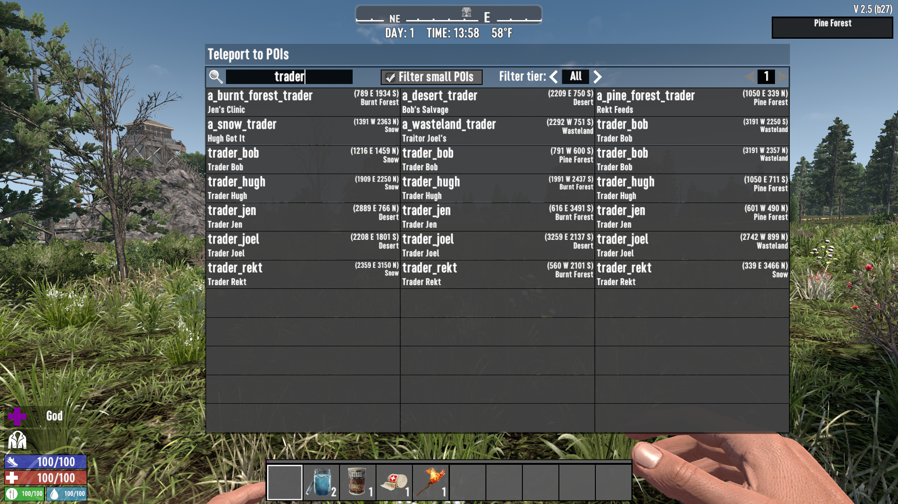
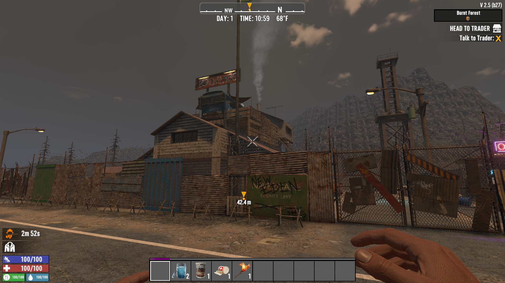
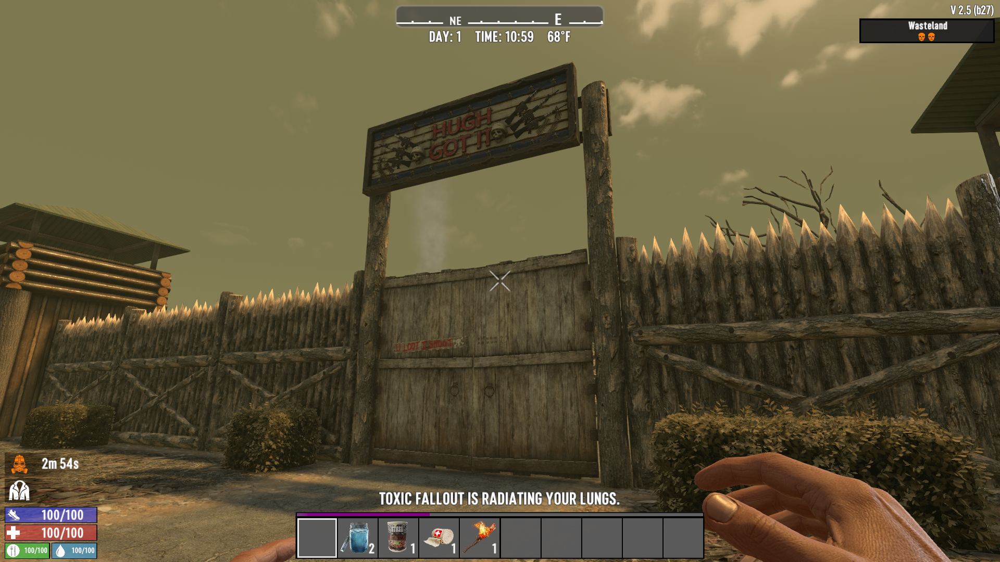
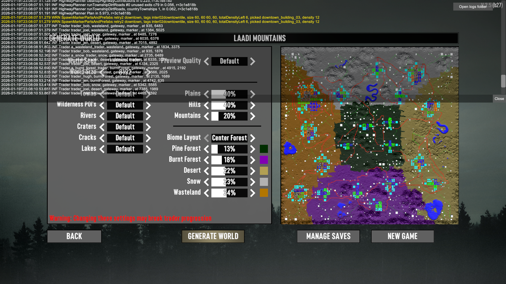
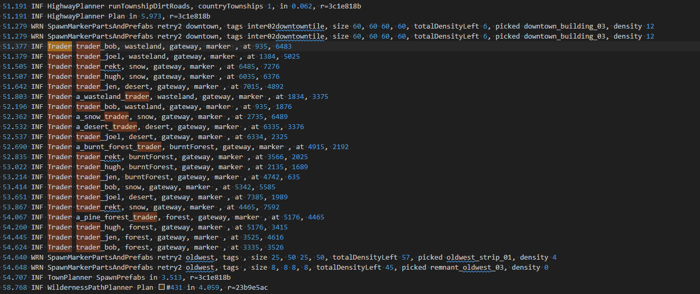
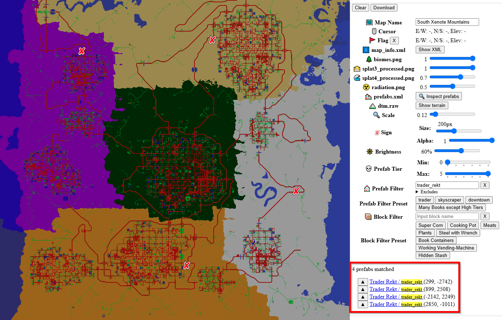

# ISI Randomized Traders

A 7 Days to Die (7D2D) mod that allows traders to spawn in any biome. For example:

- Jen can be found in all biomes, not just the Burnt Forest
- You can find Joel and Bob both in the snow, the biome isn't locked to one trader.

Includes compatibility updates for the "Journey to Settlement" and "Opening Trade Routes" quests to work with randomized trader locations.

**Note**: This mod requires a new random world generation to take effect. Existing worlds will not have randomized traders.

## January 2026 Update

On top of the randomized trader locations, an additional trader will spawn in each biome. This is to prevent RNG leaving a biome without any traders.









## How it Works

1. Assigns traders to all biomes instead of just one each
2. Update "Journey to Settlement" to send to "Pine Forest" instead of "Rekt"
3. Update "Opening Trade Routes" to send to next biome instead of next trader (i.e. send to Burnt Forest instead of assuming Jen is in the Burnt Forest)
4. Give every "Opening Trade Routes" quest to all traders since we don't know who will be visited first
5. Copy the trader POIs and add "trader" to "ThemeTags" to prevent traders from spawning next to each other (traders would all spawn in one spot leaving the rest of the map empty)
    - [khzmusik](https://7daystodiemods.com/trader-progression/) came up with this solution and allowed me to reuse it here (see "About the POIs")
6. Copy the trader POIs again, but with different names, so we can tie these copies to one biome, to guarantee at least one trader in every biome.

## Developer Testing Notes

1. Generate a new world and confirm traders spawned in multiple biomes
   - Random Gen Previewer: Open console (`F1`) and check the logs for lines that look like:

      ```text
      Trader trader_jen, desert, gateway, marker , at 7235, 5139
      Trader trader_bob, forest, gateway, marker , at 4567, 2345
      Trader trader_hugh, snow, gateway, marker , at 6789, 3456
      ```

   - ***OR*** In Game: Enable debug mode (`F1` → `dm`), open the menu (`Esc`), click "Open POI Teleporter", and search for "trader"
   - ***OR*** Use [7 Days to Die Map Renderer](https://kui.github.io/7dtd-map/) to search the map
2. Confirm randomized traders appear in non-vanilla biomes (e.g., Jen in Desert, Bob in Snow, etc.,)
3. Start "Journey to Settlement" quest and verify it takes you to any trader in the pine forest (not necessarily Rekt)
   - Use console command `givequest quest_whiteRiverCitizen1` to quickly test
4. Begin "Opening Trade Routes" and verify quest progression works with any trader in each biome
   - Use console commands `givequest tier2_nexttrader`, `givequest tier3_nexttrader`, etc., to test progression






