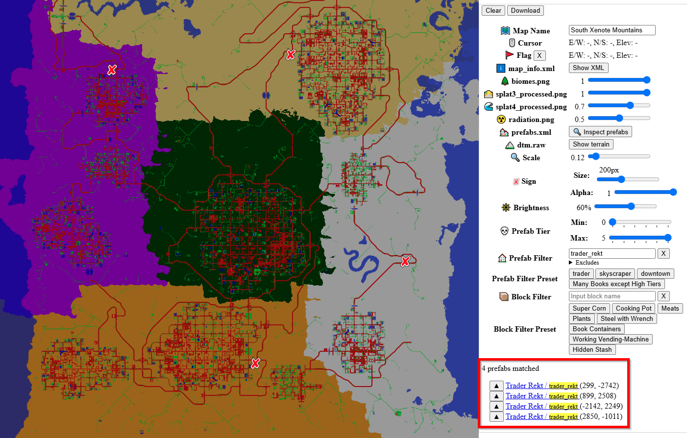
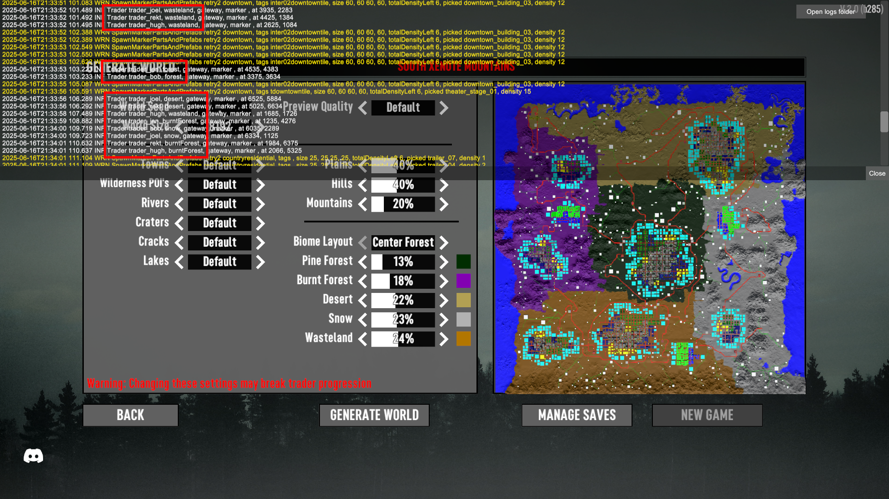
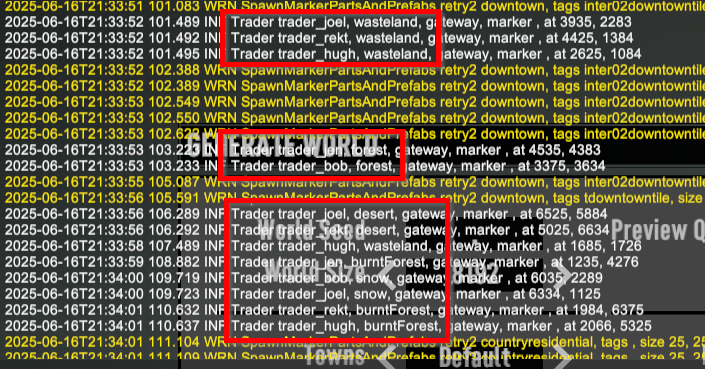

# ISI Randomized Traders

A 7 Days to Die (7D2D) mod that allows traders to spawn in any biome. Also adjusts "Journey to Settlement" and "Opening Trade Routes" quests to account for traders spawning anywhere.

## Note

Because 7D2D relies on RNG it is possible for some biomes to have many traders while others have none. Some settings have been tweaked to help avoid that, but it is still a possibility.

When you create a map make sure that at least one trader spawns in each biome. Traders are shown as red squares, and are often located on the edge of cities near major roads.

Alternatively, you can hit `F1` and look for lines that look like this: `Trader trader_jen, desert, gateway, marker , at 7235, 5139`

## Troubleshooting

### "Journey to Settlement" quest says "NO TRADER"

7D2D did not spawn the appropriate trader in the Pine Forest.

- You can still complete the quest, but you will have to find a trader in another biome.
- Restart. Create a new map and make sure the appropriate trader spawns in the Pine Forest.

### Trader did not offer the next "Opening Trade Routes" quest

7D2D did not spawn a trader in the next biome.

- Wait a day. Sometimes the quest doesn't show up until the next day.
- Visit the other traders. They may send you to the expected trader but in a different biome.
- Manually find the next trader (they won't be in the expected biome).
- Skip it. Not ideal, but you can keep working towards the next tier without going to the next trader.
- Restart. Create a new map and verify the appropriate trader spawns in each biome.

### Too many traders in one biome

1. Open `\ISI_RandomizedTraders\Prefabs\POIs\trader_bob.xml` and increase `ThemeRepeatDistance`.
2. Do the same for the other traders.
3. Then generate a new map.
4. Repeat until traders are more evenly spaced.

### Traders are not spawning in every biome

1. Open `\ISI_RandomizedTraders\Config\rwgmixer.xml` and increase `min_count` and `max_count`.
2. Generate a new map.
3. Repeat until a trader shows up in every biome.

## Testing

1. Generate a new world and check F1 logs to verify traders spawn in multiple biomes (look for: `Trader [name], [biome], gateway, marker , at [coordinates]`)
2. Verify traders appear in multiple biomes (not just their vanilla locations)
3. Start "Journey to Settlement" quest and verify it takes you to any trader in pine forest (not necessarily Rekt)
   - Use console command `givequest quest_whiteRiverCitizen1` to quickly test
4. Begin "Opening Trade Routes" and verify quest progression: forest → burnt → desert → snow → wasteland
   - Use console commands `givequest tier2_nexttrader`, `givequest tier3_nexttrader`, etc. to test progression
